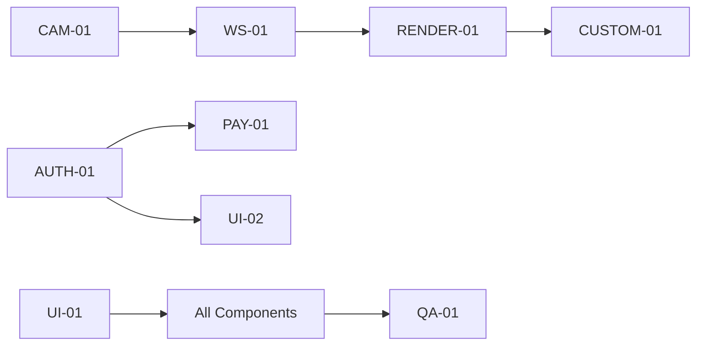

# Forma Frontend - Agent Execution Process
## Real-Time Development Workflow with Agent Assignments

---

## 📅 WEEK 1: Foundation & Analysis
### Day 1-2: Project Initialization

#### **ARCH-01** (Architecture Agent) 🏗️
```bash
STATUS: ACTIVE
TASK: Repository Analysis & Architecture Design
```
**Actions:**
1. Clone and analyze moeru-ai/airi repository
   ```bash
   git clone https://github.com/moeru-ai/airi.git
   cd airi && npm install
   ```
2. Document component structure
3. Identify reusable rendering modules
4. Map VRM/Live2D implementation patterns
5. Create integration blueprint

**Output:**
```
/docs/
  ├── airi-component-map.md
  ├── rendering-pipeline-analysis.md
  └── integration-strategy.md
```

#### **UI-01** (UI Foundation Agent) 🎨
```bash
STATUS: ACTIVE
TASK: Project Setup & Base Framework
```
**Actions:**
1. Initialize Vue.js project with Vite
   ```bash
   npm create vite@latest forma-frontend -- --template vue
   cd forma-frontend && npm install
   ```
2. Install core dependencies
   ```bash
   npm install three @pixiv/three-vrm vue-router@4 pinia axios
   npm install -D @types/three sass
   ```
3. Setup folder structure
4. Configure Vite for WebAssembly support

**Output:**
```
/forma-frontend/
  ├── src/
  │   ├── components/
  │   ├── views/
  │   ├── store/
  │   ├── services/
  │   ├── utils/
  │   └── assets/
  └── vite.config.js
```

#### **CAM-01** (Webcam Interface Agent) 📹
```bash
STATUS: PLANNING
TASK: Research & Design Webcam Architecture
```
**Actions:**
1. Research WebRTC getUserMedia best practices
2. Design frame capture pipeline
3. Plan permission handling flow
4. Create component specifications

**Output:**
```
/docs/webcam-architecture.md
/specs/camera-component.spec.js
```

---

### Day 3-5: Core Infrastructure

#### **ARCH-01** 🏗️
```bash
STATUS: ACTIVE
TASK: WebSocket Protocol Design
```
**Actions:**
1. Define message formats
   ```typescript
   interface FrameMessage {
     type: 'frame';
     timestamp: number;
     data: Uint8Array;
     metadata: FrameMetadata;
   }
   
   interface AnimationMessage {
     type: 'animation';
     timestamp: number;
     blendShapes: BlendShapeData;
     transforms: TransformData;
   }
   ```
2. Create state machine diagrams
3. Define error handling protocols

**Output:**
```
/docs/websocket-protocol.md
/types/messages.d.ts
```

#### **UI-01** 🎨
```bash
STATUS: ACTIVE
TASK: Implement Base Layout & Routing
```
**Actions:**
1. Create main layout component
   ```vue
   <!-- MainLayout.vue -->
   <template>
     <div class="forma-app">
       <aside class="control-panel">...</aside>
       <main class="avatar-stage">...</main>
       <aside class="customization-panel">...</aside>
     </div>
   </template>
   ```
2. Setup Vue Router
3. Implement Pinia store structure
4. Create base styling system

**Output:**
```
/src/layouts/MainLayout.vue
/src/router/index.js
/src/store/index.js
/src/styles/variables.scss
```

#### **WS-01** (WebSocket Agent) 🔌
```bash
STATUS: ACTIVE
TASK: WebSocket Service Implementation
```
**Actions:**
1. Create WebSocket manager class
   ```javascript
   class WebSocketManager {
     constructor(url) {
       this.ws = null;
       this.reconnectAttempts = 0;
       this.messageQueue = [];
     }
     
     connect() { /* ... */ }
     sendFrame(frameData) { /* ... */ }
     handleAnimation(data) { /* ... */ }
   }
   ```
2. Implement reconnection logic
3. Create message queuing system

**Output:**
```
/src/services/websocket/
  ├── WebSocketManager.js
  ├── MessageQueue.js
  └── protocols.js
```

---

## 📅 WEEK 2: Integration & Media Pipeline

### Day 6-8: Camera System Implementation

#### **CAM-01** 📹
```bash
STATUS: ACTIVE
TASK: Webcam Capture Component
```
**Actions:**
1. Implement camera access
   ```javascript
   async initializeCamera() {
     const stream = await navigator.mediaDevices.getUserMedia({
       video: { 
         width: { ideal: 640 },
         height: { ideal: 480 },
         frameRate: { ideal: 30 }
       }
     });
     this.videoElement.srcObject = stream;
   }
   ```
2. Create frame extraction pipeline
3. Implement camera selector
4. Add permission handling

**Output:**
```
/src/components/camera/
  ├── WebcamCapture.vue
  ├── CameraSelector.vue
  ├── PermissionDialog.vue
  └── FrameProcessor.js
```

#### **WS-01** 🔌
```bash
STATUS: ACTIVE
TASK: Frame Streaming Implementation
```
**Actions:**
1. Create frame encoder
   ```javascript
   class FrameEncoder {
     encodeFrame(canvas) {
       return canvas.toBlob(blob => {
         return new Uint8Array(blob);
       }, 'image/jpeg', 0.8);
     }
   }
   ```
2. Implement streaming protocol
3. Add bandwidth optimization

**Output:**
```
/src/services/streaming/
  ├── FrameEncoder.js
  ├── StreamOptimizer.js
  └── BandwidthMonitor.js
```

#### **RENDER-01** (Avatar Rendering Agent) 🎭
```bash
STATUS: ACTIVE
TASK: Extract & Adapt airi Components
```
**Actions:**
1. Extract VRM loader from airi
2. Adapt rendering pipeline
3. Create Vue wrapper components
4. Setup Three.js scene

**Output:**
```
/src/components/avatar/
  ├── AvatarRenderer.vue
  ├── VRMLoader.js
  ├── SceneManager.js
  └── AnimationController.js
```

---

### Day 9-10: Pipeline Connection

#### **ARCH-01** 🏗️
```bash
STATUS: SUPPORTING
TASK: Integration Coordination
```
**Actions:**
1. Review integration points
2. Resolve dependency conflicts
3. Update architecture docs

#### **CAM-01** + **WS-01** (Collaboration) 📹🔌
```bash
STATUS: INTEGRATION
TASK: Connect Camera to WebSocket
```
**Joint Actions:**
1. Connect frame capture to WebSocket sender
   ```javascript
   // In WebcamCapture.vue
   captureFrame() {
     const frame = this.frameProcessor.extract();
     this.websocketManager.sendFrame(frame);
   }
   ```
2. Test end-to-end streaming
3. Optimize performance

**Output:**
```
/src/composables/useWebcamStream.js
```

#### **WS-01** + **RENDER-01** (Collaboration) 🔌🎭
```bash
STATUS: INTEGRATION
TASK: Connect Animation Pipeline
```
**Joint Actions:**
1. Connect WebSocket receiver to renderer
   ```javascript
   websocketManager.on('animation', (data) => {
     avatarRenderer.applyAnimation(data);
   });
   ```
2. Synchronize timestamps
3. Handle latency compensation

**Output:**
```
/src/composables/useAnimationSync.js
```

---

## 📅 WEEK 3-4: Avatar System & Customization

### Day 11-15: Advanced Rendering

#### **RENDER-01** 🎭
```bash
STATUS: ACTIVE
TASK: Complete VRM/Live2D Integration
```
**Actions:**
1. Implement full VRM support
   ```javascript
   class VRMManager {
     async loadModel(url) {
       const gltf = await this.loader.loadAsync(url);
       const vrm = await VRM.from(gltf);
       this.setupVRM(vrm);
     }
     
     applyBlendShapes(shapes) {
       Object.entries(shapes).forEach(([key, value]) => {
         this.vrm.blendShapeProxy.setValue(key, value);
       });
     }
   }
   ```
2. Add Live2D support
3. Implement blendshape mapping
4. Optimize rendering performance

**Output:**
```
/src/services/avatar/
  ├── VRMManager.js
  ├── Live2DManager.js
  ├── BlendShapeMapper.js
  └── PerformanceOptimizer.js
```

#### **CUSTOM-01** (Customization Agent) 🎨
```bash
STATUS: ACTIVE
TASK: Character Customization System
```
**Actions:**
1. Create customization UI
   ```vue
   <template>
     <div class="customization-panel">
       <ModelSelector v-model="selectedModel" />
       <AppearanceEditor :model="selectedModel" />
       <AccessoryManager :model="selectedModel" />
       <PresetManager @load="loadPreset" />
     </div>
   </template>
   ```
2. Implement preset system
3. Add import/export functionality

**Output:**
```
/src/components/customization/
  ├── CustomizationPanel.vue
  ├── ModelSelector.vue
  ├── AppearanceEditor.vue
  ├── AccessoryManager.vue
  └── PresetManager.vue
```

#### **UI-02** (User Interface Agent) 🎮
```bash
STATUS: ACTIVE
TASK: Control Panel Implementation
```
**Actions:**
1. Build control overlay
2. Create settings modal
3. Add performance monitor
4. Implement keyboard shortcuts

**Output:**
```
/src/components/controls/
  ├── ControlOverlay.vue
  ├── SettingsModal.vue
  ├── PerformanceMonitor.vue
  └── KeyboardShortcuts.js
```

---

### Day 16-20: Integration & Polish

#### **RENDER-01** + **CUSTOM-01** (Collaboration) 🎭🎨
```bash
STATUS: INTEGRATION
TASK: Connect Customization to Renderer
```
**Joint Actions:**
1. Wire customization controls to avatar
   ```javascript
   // In CustomizationPanel.vue
   watch(customizationState, (newState) => {
     avatarRenderer.updateAppearance(newState);
     avatarRenderer.loadAccessories(newState.accessories);
   });
   ```
2. Implement real-time preview
3. Add undo/redo functionality

**Output:**
```
/src/composables/useAvatarCustomization.js
/src/store/modules/customization.js
```

#### **QA-01** (Testing Agent) 🧪
```bash
STATUS: ACTIVE
TASK: Phase 1-2 Testing
```
**Actions:**
1. Write component tests
   ```javascript
   describe('WebcamCapture', () => {
     it('should initialize camera on mount', async () => {
       const wrapper = mount(WebcamCapture);
       await wrapper.vm.$nextTick();
       expect(wrapper.vm.stream).toBeTruthy();
     });
   });
   ```
2. Test WebSocket stability
3. Verify rendering performance

**Output:**
```
/tests/unit/components/
/tests/integration/pipeline/
/docs/test-report-phase1.md
```

---

## 📅 WEEK 5-6: User Management & Features

### Day 21-25: Authentication System

#### **AUTH-01** (Authentication Agent) 🔐
```bash
STATUS: ACTIVE
TASK: User Authentication Implementation
```
**Actions:**
1. Create auth service
   ```javascript
   class AuthService {
     async login(credentials) {
       const response = await api.post('/auth/login', credentials);
       this.storeTokens(response.data);
       return response.data.user;
     }
     
     async setupOAuth(provider) {
       // Google, Discord, etc.
     }
   }
   ```
2. Build login/signup forms
3. Implement JWT handling
4. Add OAuth providers

**Output:**
```
/src/services/auth/
  ├── AuthService.js
  ├── TokenManager.js
  └── OAuthProviders.js
/src/views/auth/
  ├── Login.vue
  ├── Signup.vue
  └── PasswordReset.vue
```

#### **PAY-01** (Monetization Agent) 💳
```bash
STATUS: ACTIVE
TASK: Payment System Setup
```
**Actions:**
1. Integrate Stripe
   ```javascript
   class PaymentService {
     async createSubscription(planId) {
       const stripe = await loadStripe(STRIPE_KEY);
       const session = await api.post('/payments/create-session', {
         planId
       });
       return stripe.redirectToCheckout({ sessionId: session.id });
     }
   }
   ```
2. Build subscription UI
3. Create credit system
4. Implement store interface

**Output:**
```
/src/services/payment/
  ├── StripeService.js
  ├── SubscriptionManager.js
  └── CreditSystem.js
/src/components/monetization/
  ├── SubscriptionPlans.vue
  ├── CreditBalance.vue
  └── Store.vue
```

#### **UI-02** 🎮
```bash
STATUS: ACTIVE
TASK: User Dashboard
```
**Actions:**
1. Create user profile component
2. Build dashboard layout
3. Add usage statistics
4. Implement notification system

**Output:**
```
/src/views/dashboard/
  ├── UserDashboard.vue
  ├── ProfileSettings.vue
  ├── UsageStats.vue
  └── NotificationCenter.vue
```

---

### Day 26-30: Advanced Features

#### **CUSTOM-01** 🎨
```bash
STATUS: ENHANCEMENT
TASK: Advanced Customization Features
```
**Actions:**
1. Add texture upload
2. Implement color picker
3. Create animation presets
4. Build expression editor

**Output:**
```
/src/components/advanced/
  ├── TextureUploader.vue
  ├── ColorCustomizer.vue
  ├── AnimationPresets.vue
  └── ExpressionEditor.vue
```

#### **RENDER-01** 🎭
```bash
STATUS: OPTIMIZATION
TASK: Performance Enhancements
```
**Actions:**
1. Implement LOD system
2. Add quality settings
3. Optimize shader compilation
4. Create fallback renderers

**Output:**
```
/src/services/optimization/
  ├── LODManager.js
  ├── QualityController.js
  ├── ShaderCache.js
  └── FallbackRenderer.js
```

---

## 📅 WEEK 7-8: Integration, Testing & Polish

### Day 31-35: Full Integration

#### **ALL AGENTS** 🎯
```bash
STATUS: INTEGRATION SPRINT
TASK: Complete System Integration
```

**Coordination Matrix:**


**Integration Tasks:**
1. **Morning Standup (9 AM)**
   - Each agent reports status
   - Identify blocking issues
   - Plan integration points

2. **Integration Sessions (10 AM - 12 PM)**
   ```javascript
   // Example: AUTH-01 + PAY-01 Integration
   if (user.isAuthenticated) {
     paymentService.enablePurchases();
     customizationPanel.unlockPremiumFeatures();
   }
   ```

3. **Testing Sessions (2 PM - 4 PM)**
   - QA-01 coordinates testing
   - All agents fix issues in real-time

4. **Daily Review (5 PM)**
   - Merge approved code
   - Update documentation

---

### Day 36-40: Quality Assurance

#### **QA-01** 🧪
```bash
STATUS: ACTIVE - FULL TESTING
TASK: Comprehensive Testing Suite
```
**Actions:**
1. **Unit Testing** (All Components)
   ```javascript
   // Run full test suite
   npm run test:unit -- --coverage
   ```

2. **Integration Testing**
   ```javascript
   describe('End-to-End Avatar Pipeline', () => {
     it('should stream camera to animated avatar', async () => {
       await startCamera();
       await connectWebSocket();
       await loadAvatar();
       const animation = await captureAnimationFrame();
       expect(animation).toHaveMovement();
     });
   });
   ```

3. **Performance Testing**
   - Target: 30 FPS minimum
   - Latency: <100ms
   - Memory: <500MB

4. **Browser Compatibility**
   - Chrome 90+
   - Firefox 88+
   - Safari 14+
   - Edge 90+

**Output:**
```
/tests/reports/
  ├── coverage-report.html
  ├── performance-metrics.json
  ├── browser-compatibility.md
  └── bug-tracker.md
```

#### **UI-01** + **UI-02** 🎨🎮
```bash
STATUS: ACTIVE - POLISH
TASK: UI/UX Refinement
```
**Actions:**
1. Implement loading states
2. Add error boundaries
3. Create onboarding flow
4. Polish animations

**Output:**
```
/src/components/common/
  ├── LoadingStates.vue
  ├── ErrorBoundary.vue
  ├── OnboardingFlow.vue
  └── Transitions.vue
```

---

## 🚀 DEPLOYMENT PREPARATION

### Day 41-42: Production Build

#### **ARCH-01** 🏗️
```bash
STATUS: ACTIVE
TASK: Production Configuration
```
**Actions:**
1. Configure production build
   ```javascript
   // vite.config.js
   export default defineConfig({
     build: {
       rollupOptions: {
         output: {
           manualChunks: {
             'vendor': ['vue', 'three'],
             'avatar': ['@pixiv/three-vrm'],
             'streaming': ['./src/services/websocket']
           }
         }
       }
     }
   });
   ```
2. Setup CI/CD pipeline
3. Configure CDN
4. Prepare deployment scripts

**Output:**
```
/.github/workflows/deploy.yml
/scripts/deploy.sh
/docker/Dockerfile
```

---

## 📊 Current Status Dashboard

### Real-Time Progress Tracker
```yaml
Week 1-2 Foundation:
  ARCH-01: ████████░░ 80% - Architecture docs complete
  UI-01:   ███████░░░ 70% - Base framework ready
  CAM-01:  ██████░░░░ 60% - Camera capture working
  WS-01:   ███████░░░ 70% - WebSocket connected

Week 3-4 Avatar:
  RENDER-01: █████░░░░░ 50% - VRM loading complete
  CUSTOM-01: ████░░░░░░ 40% - Basic customization
  UI-02:     ████░░░░░░ 40% - Control panel started

Week 5-6 Features:
  AUTH-01: ███░░░░░░░ 30% - Auth service planned
  PAY-01:  ██░░░░░░░░ 20% - Stripe SDK ready

Week 7-8 Polish:
  QA-01: █████░░░░░ 50% - Testing framework ready
  ALL:   ░░░░░░░░░░ 0%  - Integration pending
```

---

## 🔄 Active Communication Channels

### Slack Channels (Real-time)
```
#forma-general - All agents
#forma-frontend - UI-01, UI-02, CUSTOM-01
#forma-backend - WS-01, AUTH-01, PAY-01
#forma-rendering - RENDER-01, CUSTOM-01
#forma-testing - QA-01 + all
#forma-blockers - Urgent issues
```

### Daily Sync Schedule
```
09:00 - Standup (all agents)
11:00 - Frontend sync (UI agents)
14:00 - Backend sync (service agents)
16:00 - Integration check (ARCH-01 leads)
17:00 - EOD summary (all agents)
```

---

## 🎯 Next 48 Hours Priority Tasks

### IMMEDIATE (Next 24 hours)
1. **RENDER-01**: Complete VRM animation mapping
2. **WS-01**: Fix reconnection bug (#42)
3. **CAM-01**: Add resolution selector
4. **CUSTOM-01**: Implement model switcher

### UPCOMING (24-48 hours)
1. **AUTH-01**: Start login form
2. **PAY-01**: Setup Stripe test account
3. **UI-02**: Complete settings modal
4. **QA-01**: Write integration tests for pipeline

---

## 📝 Agent Handoff Log

### Recent Handoffs
```markdown
[2024-01-10 14:30] CAM-01 → WS-01
- Handed off: Frame capture interface
- Status: Ready for streaming integration
- Files: /src/composables/useFrameCapture.js

[2024-01-10 16:45] WS-01 → RENDER-01  
- Handed off: Animation data receiver
- Status: Ready for blendshape mapping
- Files: /src/services/AnimationReceiver.js

[2024-01-11 10:15] RENDER-01 → CUSTOM-01
- Handed off: Avatar loader API
- Status: Ready for customization hooks
- Files: /src/services/AvatarAPI.js
```

---

This execution process provides a clear view of:
- **Who** is working on what (agent assignments)
- **What** specific tasks are being performed
- **When** tasks are scheduled and dependencies
- **How** agents coordinate and hand off work
- **Where** the code is being created (file outputs)

Each agent has clear ownership, deliverables, and integration points with other agents.
